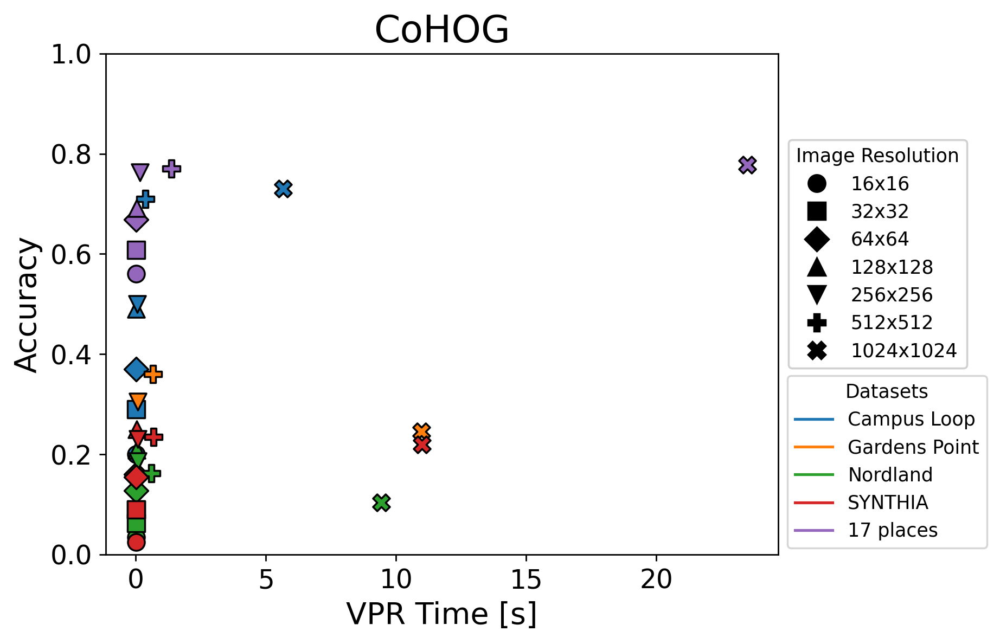
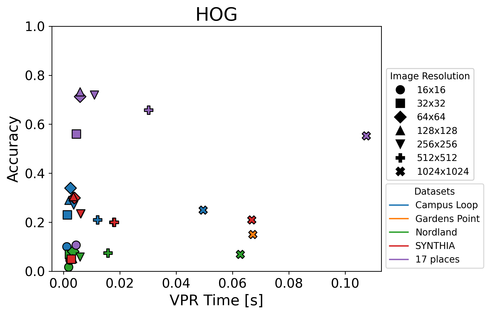
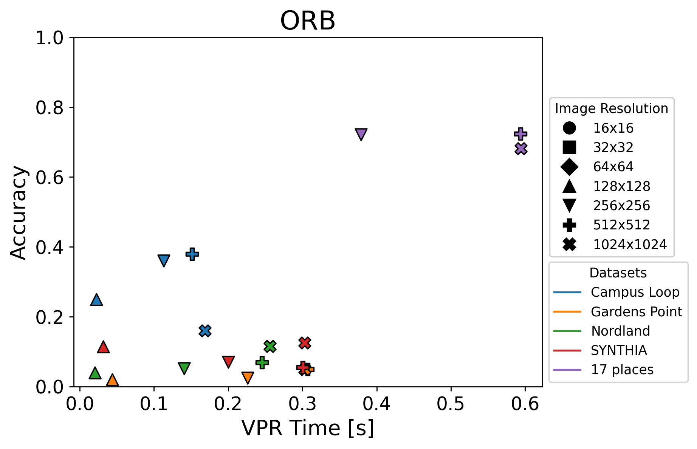
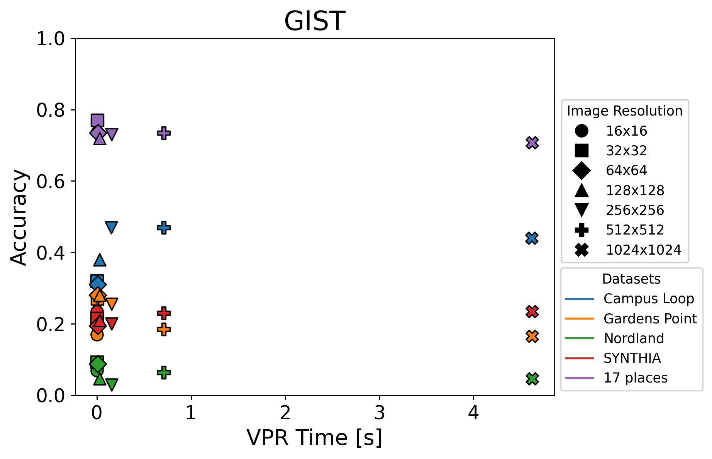

# Data-efficient Visual Place Recognition Using Low-Resolution Images

This repository contains the techniques used in the following paper:

**Title:** Visual Place Recognition with Low-Resolution Images  
**Authors:** Mihnea-Alexandru Tomita, Bruno Ferrarini, Michael J. Milford, Klaus D. McDonald-Maier and Shoaib Ehsan

Published in 2023 IEEE International Conference on Robotics and Automation (ICRA) Workshop on Active Methods in Autonomous Navigation, London, UK.

Paper available [here](https://robotics.pme.duth.gr/workshop_active2/wp-content/uploads/2023/05/05.-Visual-place-recognition.pdf).

## 📖 Overview 

Visual Place Recognition (VPR) enables a robot to recognise previously visited places using visual information from a camera. While state-of-the-art systems often rely on high-resolution images and high-end hardware, many real-world applications must operate with low-resolution, resource-constrained cameras.

In this work, we investigate how image resolution impacts the accuracy, robustness, and efficiency of several well-established handcrafted VPR techniques. Handcrafted methods are computationally lightweight and adaptable to flexible image resolutions, making them suitable for deployment on low-end commercial devices.

Our study shows that:

- **Global feature descriptors** remain robust at lower image resolutions, whereas **local feature descriptors** struggle on very small images.

- **Lowering image resolution reduces computation time**, making VPR more efficient without requiring high-end hardware.

- This trade-off between resolution and performance demonstrates the feasibility of deploying VPR on **low-end consumer products**.

The handcrafted VPR techniques implemented in this repository are HOG, ORB and GIST. For HOG, a cell and block size of `16x16` pixels was used, with a total of `9` histogram bins. Another VPR technique used in the paper, CoHOG, is not included here as we did not modify its implementation. Instead, please refer to the original [CoHOG repository](https://github.com/MubarizZaffar/CoHOG_Results_RAL2019).

## ⚙️ Requirements

- **GIST**
    - **pyleargist** - required to run the GIST implementation. Install it following the instructions here: [pyleargist-python3](https://github.com/mertyyanik/pyleargist-python3).
    - **Pillow (PIL)** - used for image processing.
- **HOG & ORB** - `numpy`, `opencv-python`.
- **CoHOG** - `numpy`, `opencv-python`, `matplotlib`, `scikit-image`, `numba`, `scipy`.

## 📊 Performance and Computation Trade-off Analysis

The plots below show the trade-off between accuracy and VPR computation time for different image resolutions across the implemented techniques.

<table>
  <tr>
    <td>
       
    </td>
    <td>
       
    </td>
  </tr>
  <tr>
    <td>
       
    </td>
    <td>
       
    </td>
  </tr>
</table>

- **x-axis:** VPR time required to perform place matching on each resized dataset.

- **y-axis:** Accuracy achieved by each technique.

Overall, CoHOG achieves higher place-matching performance with larger image resolutions, but this comes at the cost of a considerable increase in computation time. In contrast, techniques such as HOG and GIST perform relatively better at lower resolutions, offering a more efficient trade-off between accuracy and computational requirements.

> Note: This analysis is not part of the published paper but it is closely related and provides additional insights into the performance-computation trade-off.

## 📄 Citation

If you found this repository helpful, please cite the paper below:
<pre>
@article{tomita2023visual,
  title={Visual place recognition with low-resolution images},
  author={Tomita, Mihnea-Alexandru and Ferrarini, Bruno and Milford, Michael and McDonald-Maier, Klaus and Ehsan, Shoaib},
  journal={arXiv preprint arXiv:2305.05776},
  year={2023}
}
 </pre>

